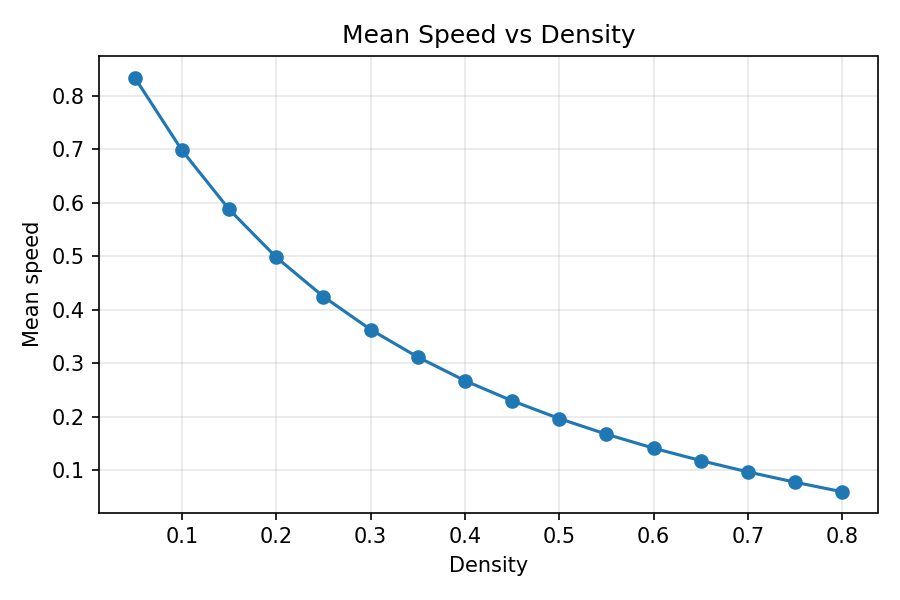
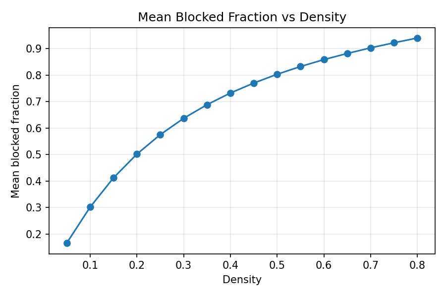

# emergent-congestion-simulation

This project runs an agent-based traffic model on a periodic 2D grid and sweeps agent density to measure emergent congestion, reporting mean speed and blocked fraction across replications.

## Quickstart

```bash
python -m venv .venv
```

Activate the virtual environment for your OS before installing dependencies:

- macOS/Linux:
  ```bash
  source .venv/bin/activate
  ```
- Windows PowerShell:
  ```powershell
  .\.venv\Scripts\Activate.ps1
  ```
- Windows cmd:
  ```bat
  .\.venv\Scripts\activate.bat
  ```

```bash
pip install -r requirements.txt
python scripts/run_experiment.py --config configs/base.json
```

## Outputs

- `results/summary.csv`
- `results/config_used.json`
- `results/analysis.json`
- `results/plots/speed_vs_density.png`
- `results/plots/blocked_vs_density.png`

## Reproducibility

- Deterministic seeding is used per (density, replication) so the same config yields identical results.
- Re-running with the same `output_dir` overwrites `summary.csv`, `config_used.json`, and plots.

## Critical density estimate

After each density sweep, the project estimates a critical density from the steepest drop in
`mean_speed` between adjacent density points. The estimate is written to:

- `results/analysis.json`
- `results/summary.csv` columns `critical_density_est` and `critical_drop_est`

## Results (example)




## Model rules (baseline)

- Grid is `N x N` with periodic wrap-around.
- Each cell holds at most one agent.
- Agents propose moving one cell forward (direction fixed per agent).
- A move only succeeds if the target cell is empty and uniquely targeted.
- Updates are synchronous (parallel), and collisions block all involved moves.

## Extension: turning probability

Optional behavior: set `p_turn` (0 to 1) to allow agents to randomly turn left or right before each move proposal. Use `--p-turn` on the CLI or set it in the config JSON.

## Optional snapshots

Set `save_snapshots: true` in config to save occupancy images for selected densities.

- `snapshot_densities`: densities to render (e.g. `[0.1, 0.4, 0.7]`)
- `snapshot_step`: either `"last"` or a zero-based measurement-step index

Output files are written to `results/snapshots/` (for example, `density_0.40.png`).

## Optional time series export

Set `save_time_series: true` in config to export per-timestep metrics for selected densities.

- `time_series_densities`: densities to export (e.g. `[0.4]`)
- `time_series_replication`: replication index to export (zero-based)

Output files are written to `results/time_series/` (for example, `density_0.40_rep_0.csv`).
